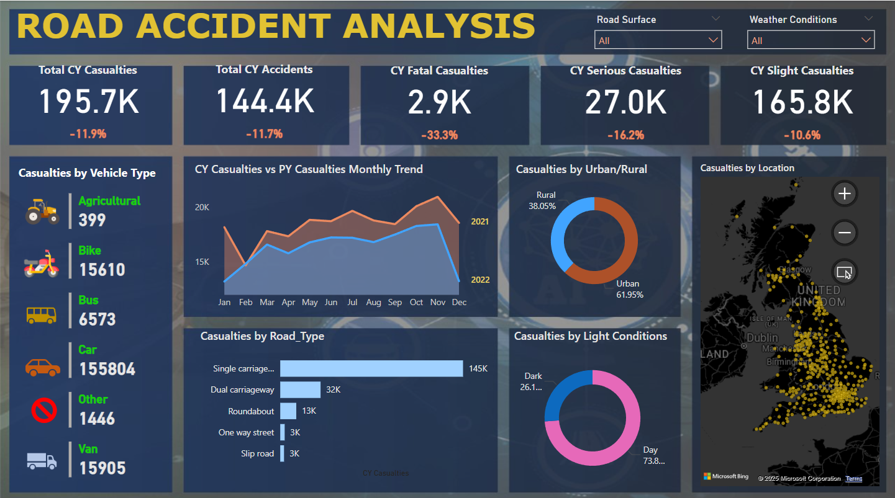

# 🚦 Road Accident Analysis - Power BI Dashboard

## 📊 Overview

This Power BI project visualizes **road accident data from the United Kingdom** to provide actionable insights into the frequency, severity, and distribution of road accidents. The dashboard serves as a comprehensive tool for stakeholders, policymakers, analysts, and the general public to understand patterns and trends in road safety.

---

## 🧾 Key Metrics

- **Total CY Casualties**: 195.7K (⬇️ 11.9%)
- **Total CY Accidents**: 144.4K (⬇️ 11.7%)
- **CY Fatal Casualties**: 2.9K (⬇️ 33.3%)
- **CY Serious Casualties**: 27.0K (⬇️ 16.2%)
- **CY Slight Casualties**: 165.8K (⬇️ 10.6%)

---

## 🔍 Dashboard Insights

### 📅 Casualty Trends
- Monthly comparison of **Current Year (CY)** vs **Previous Year (PY)** casualties.

### 🚗 Casualties by Vehicle Type
- **Cars** account for the majority of casualties (~155K), followed by **Vans** and **Bikes**.

### 🌍 Location Breakdown
- An interactive **UK map** highlighting accident hotspots.

### 🏙️ Urban vs Rural
- Urban areas: 61.95%
- Rural areas: 38.05%

### 🛣️ Road Type Analysis
- Most casualties occurred on **Single carriageways (145K)**.

### 🌒 Light Conditions
- Majority of accidents occurred during the **Day (73.8%)**, compared to **Dark (26.1%)**.

---

## 🛠️ Built With

- **Power BI Desktop**
- **Microsoft Bing Maps** for geolocation
- Cleaned and visualized UK government road accident data *(source not included in this repo)*

---

## 📌 How to Use

1. Clone or download the repository.
2. Open the `.pbix` file using **Power BI Desktop**.
3. Explore or modify the visualizations based on your analysis needs.
4. Filter data by **road surface**, **weather conditions**, and other parameters for deeper insights.

---

## 💡 Use Cases

- Road safety awareness campaigns
- Government transportation policy planning
- Insurance and risk assessment analysis
- Data storytelling and dashboard design inspiration

---

## 📬 Contact

For queries or suggestions, feel free to reach out via GitHub issues.
